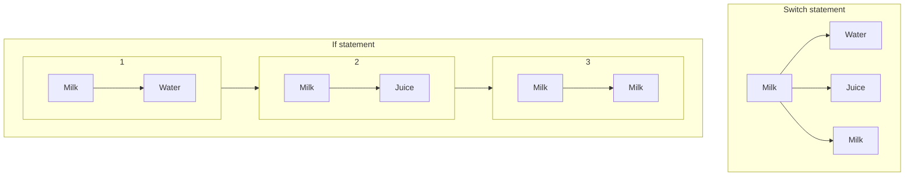

[C#]
# C# 9 Features - Why, and when to use

https://docs.microsoft.com/en-us/dotnet/csharp/whats-new/csharp-9

## Record Types

If you have ever tried Kotlin, you've seen the `data` class. And the F# already [had record type](https://fsharpforfunandprofit.com/posts/records/). (Thinking immutability of functional language, it's not surprise) And it's finally on C#. But, why? Why they're not happy with just `class` and `readonly` fields?

The point is: **the whole class is `readonly`**. It's better for concurrency, when data is shared.

This is most useful when you design **models**, including **database classes**. It can represent real database (Think of the Entity Framework) or DTO (Domain Transfer object) - but when it's implemented in DTO, consider of immutability (if it's changed frequently may not fit - `initonly` may better choice dppending on the situation). Not only anemic class (class with only data types), but you can define some methods, so non-anemic data goes along too. EF Core can have [inheritance](https://docs.microsoft.com/en-us/ef/core/modeling/inheritance)? No problem. Record supports inheritance too.

It works well with **(de)serialization**, such as JSON serializer. (But please be careful with the case-sensitivity of the keys!)

```CSharp
//the record
record OperatingSystem(string Name, string Version);
```

```CSharp
using System;
using System.Text.Json;

OperatingSystem os = JsonSerializer.Deserialize<OperatingSystem>("{\"Name\":\"Windows\", \"Version\":\"8.1\"}");
Console.WriteLine($"{os.Name} {os.Version}"); //Windows 8.1

OperatingSystem anotherOS = os with { Version = "XP" }; // NOTE: it does *shallow copy*
string serializedOS = JsonSerializer.Serialize(anotherOS);
Console.WriteLine(serializedOS); //{"Name":"Windows","Version":"XP"}
```

> According to .NET Conf 2020, anonymous record is not supported, though can come with C# 10.

## Init Only

If you want to make property readonly (so only can set inside constructor), you can put only `get` (getter) without `set` (setter). This way you can initialize values with *inside constructor*.

This `init` is different from the readonly (get only) in two ways:

1. You can initialize **when creating**.
2. Constructor of **inherited class** can initialize it.

This is the example of first feature. First, you define a class like this:

```CSharp
    class Asdf
    {
        public string S { get; }
        public int X { get; init; }
    }
```

And try this:

```Csharp
    new Asdf {
        X = 1, //OK
        S="Test" //Error
    };
```

You can make **properties readonly without constructor arguments**. Especially if there are many properties, the definition and usage can be nasty. (There are also something like `new X(a:1, b:3)`, still you must struggle with some optional or non-optional parameters, constructor defintion is tiring and you must write more boring usage documnetation...) - or giving all of them just setter, but if not initialization only, unintended annoying value change can occur. And that's why init only is good. Consider:

```CSharp
//If...
class Product
{
    public string Name { get; }
    public float Price { get; }
}
//Then...
Product product = new Product
{
    Name = "T-Shirt",
    Price = 12.30f
};
//Won't work.
//--------------------
//But if...
class Product
{
    public string Name { get; set; }
    public float Price { get; set; }
}
//Then...
Product product = new Product
{
    Name = "T-Shirt",
    Price = 12.30f
};
product.Name = "Ice Cream";
//You can change Product name, which *isn't expected*
//-----------

//So you can solve both problem with it.
class Product
{
    public string Name { get; init; }
    public float Price { get; init; }
}
//Now you can do this
Product product = new Product
{
    Name = "T-Shirt", //all of them are optional
    Price = 12.30f
};
//But cannot do this
product.Name = "Ice Cream";
//------------
//Also can set default value from wherever
class Product
{
    public string Name { get; init; } = "Chocolate";
    public float Price { get; init; } = 5.99f;
}
```

You can read more clear descriptions from [here](https://docs.microsoft.com/en-us/dotnet/csharp/language-reference/proposals/csharp-9.0/init).

> As you see in the link above, there are some features that proposed but not implemented, such as `initonly` or `init set`.

If you want to make immutable part of the properties after initializing, `init` is for you. Now we can control easily what can be changed or what cannot be changed.

## Top-level statements


Top-level statements **is all about just defining inside `Main` method** - `string[] args` are automatically defined and return value should be `int` (or nothing, just `return;`).

Microsoft Docs tells about some benefits of the top-level statements like this:

1. Teaching material. Hello world in 1-2 line lowers threshold.
2. Script experience.
3. **Azure Functions** is good usage of the top-level statements.
4. **Scope Complexity**.

> Note: Know the limitations of this. C# is not like JavaScript or Python - it's still class-based langauge.
>
> 1. You can define **only one file (main) per project** - if something is top-level statement, it becomes main file. Outside of them you still need to define a class/struct/record.
> 2. The file that contains top-level statement **cannot contain any class/struct/record definition**.

## Pattern matching enhancements

### Pattern matching, why?
You can check some statements with `if-else` statements, but it's nasty. Besides, `if` compares only **once at a time**, so it's [usually slower than `switch`](https://twitter.com/MadsTorgersen/status/1326230723649392640?s=20).



Still it's usually not so big optimization, so it looks like matter of taste, if small performance doesn't matter. But reading codes in a glance without "if" text is more clear, so, now there are two important reasons to use switch(pattern matching) in many ways.

The imporved pattern matching is [supported from C# 8.0](https://docs.microsoft.com/en-us/archive/msdn-magazine/2019/may/csharp-8-0-pattern-matching-in-csharp-8-0). Now C# 9 supports:

* `and`, `or` and `not`. (Note that `when` match was already existed before C# 9.)
* \>= and =< operators.
* Nested pattern match (for example, inside `()`) support ("Parenthesized" pattern)

Still there are some taste matters left, [for example](https://twitter.com/RicoSuter/status/1326322704774000641?s=20):


It's not familiar for old C# developers, but it's worth to use the advanced pattern matching. (Especially if you want to be familiar with functional programming)

## Fit and Finish

This is just a **syntax sugar**. And why it's good is you can write less code.

```CSharp
Product product { get; set; }
//...
product = new() { Name = "Toy", Price = 11.2f };
OperatingSystem os = new("Windows", "Vista");
```

Besides, you have less concern to the typo.

```CSharp
new HttpRequestMessage(new("POST"), "https://localhost"); //HTTP Method, Uri(string)
new Regex("/[0-9]/", new(), new(2000)); //Regex Options, Timespan
```

## Code generator (A.k.a. Source generator)

Source generator generates source from code. Benefits of source generator is described in [here](https://devblogs.microsoft.com/dotnet/introducing-c-source-generators/). The link also describes what it is and how to use.

1. The **startup/runtime performance** is better (Wiring up, by *saving settings*)  
   Runtime-costs (*reflection*) performance will move to compile-time.  
2. When **compiler is called multiple times**, source generator is faster.  
   When inspecting data for compilation, this can occur.
3. "**Stringly Typed**" (PREDEFINE TYPES!)  
   For example, ASP.NET Core Routing: For example, `{name:int}` should check if route value is `int`.

> Note: Even if code generator can replace some of reflection to AOT-compiled code, it's not for replacing reflection - reflection is still powerful tool so you may not need to change it.
