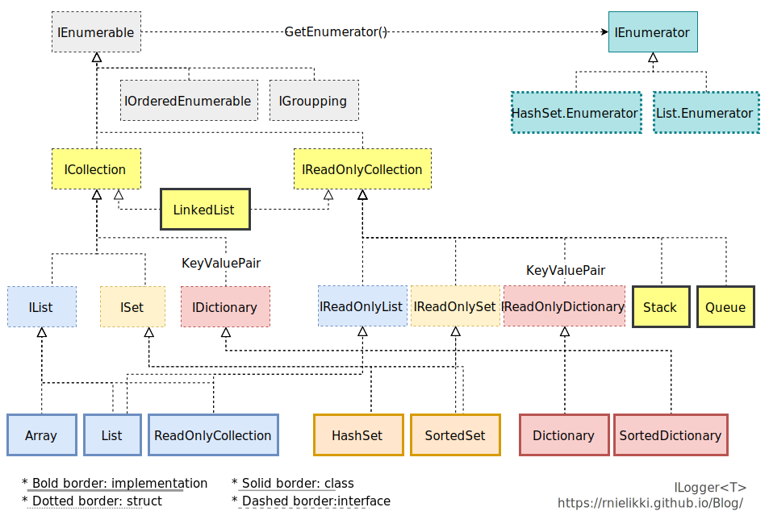

[C#]
# IEnumerables&lt;T&gt; and collections, part 1


## What is IEnumerable

Imagine you just have some similar items - lego blocks, beads, pencils, or whatever. You didn't give number to them, so they don't have index, but you can take one by one.

* It has order internally, but it doesn't expose it.
* The value never changed (immutable). Any LINQ methods will return **new value**.

### Why `Count()` is not recommended

<s>[STOP THE `Count()`!](https://twitter.com/realdonaldtrump/status/1324353932022480896)</s>

If the types is IEnumerable, you cannot avoid using `Count()` **method**. But if the type is `ICollection<T>` or its implementation, you can use `Count` **property**. And here is why:

Imagine you have some items like blocks or coins. You don't know  how much is it at a glance, so you count them one by one. this is what `Count()` method does. On the other hand, collection already counted them and remembrs how many items they have. So it's property. If someone already checked how many is it (and you trust the number), you don't need to count by yourself.

## Immutability

Immutablity prevents from mistake or unintended editing behaviour.

* `IEnumerable<T>` are **immutable**.
  * Calling method with LINQ (`System.Linq`) will return new `IEnumerable<T>` instead of changing original one.
* `ICollection<T>` is **mutable**.
  * `IReadOnlyCollection<T>` is **not really immutable**. It just wraps its aggregation. If you want true immutablity, use `ImmtuableList<T>`

### `IReadOnlyCollection<T>`

`IReadOnlyCollectoin<T>` just contains mutable collection inside. This is useful when **expose collection** outside class.

```csharp
public List<string> Names { get; }
```

The *get-only* means in here *you cannot assign new value*. You cannot assign new value, but you still can call the method like `Add()`. This is not intended - it should be mutable only inside class.

```csharp
//you can't do this
className.Names = new List<string>();
//you CAN do this
className.Names.Add("John");
```

That's why .NET guideline say **do not expose List public, use ReadOnly... instead.**. But is it really immutable? No. **You can edit the target list**.

```csharp
List<string> languages = new(){ "C#", "F#" };
ReadOnlyCollection<string> readonlyLanguages = new(languages);
languages.Add("VB.NET");
//now readonlyLanguages returns : ReadOnlyCollection<string>(4) { "C#", "F#", "VB.NET" }
```

### What `ImmutableList<T>` (or any `Immutable...<T>`) does

If you have already used F#, you can understand easier the `ImmutableList<T>`. You initialize them by calling empty and adding - in this way, they always return new value - like `IEnumerable<T>`, it's truly immutable.

Also `Immutable...<T>` is **thread safe**.

> `System.Collections.Immtable` is available via NuGet package manager.

## IEnumerator&lt;T&gt;

`IEnumerable<T>` and `IEnumerator<T>` don't have any inherit relationship. `IEnumerable<T>` creates `IEnumerator<T>` by calling `GetEnumerator()` method.

`IEnumerator<T>` is interface for iterator. [Iterator](https://en.wikipedia.org/wiki/Iterator_pattern) is design pattern for traversing elements inside container.

Each class that inherited from `IEnumerator<T>` also implements `GetEnumerator()`, so Enumerator has own implementation - for example, `List<T>.Enumerator`. `foreach()` loop calls `GetEnumerator()` to iterate.

Implementation of Enumerator is `struct`, because iterator is small and simple. Using struct for small object [improves performance](https://softwareengineering.stackexchange.com/questions/411302/why-listt-enumerator-is-struct).

> **Do not edit the aggregation while iterating**, include `foreach()` loop. If collection is changed after getting `IEnumerator<T>`, `IEnumerator<T>.MoveNext()` will throw exception.

## IGroupping and IOrderedEnumerable

This is common when `System.Linq` is used. `IGroupping` is result of `IEnumerable<T>.GroupBy()` and `IOrderedEnumerable` is result of `IEnumerable<T>.OrderedBy()` (or `IEnumerable<T>.OrderByDescending()`)

`IOrderedEnumerable<T>` assures that they are ordered by some criteria - not much difference from `IEnumerable<T>` (But may used for further custom implemenation).

## Collection

Unlike `IEnumerable<T>`, now it's mutable - can add, remove, or get how much is it without counting. Still they **don't have index**, so it works with concept of **set** (which really implements `ICollection<T>`)

`IReadOnlyCollection` **does not implement add/delete**. Instead, it implements only `Count()`. This is used by some read-only collections that doesn't need to implement adding and deleting.

Another interesting implemenation is `Stack` and `Queue` - they aren't readonly, but the naming is bit different - it doesn't "add/delete", but "push/pop/queue/dequeue". So they are implemented own editing behaviours with their own name.

[Next...](./ienumerable-part2.html)
