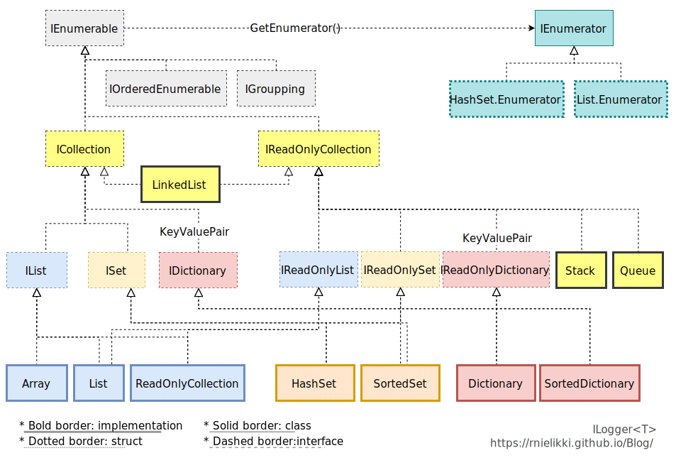

[C#]
# IEnumerables and collections, part 2

[Before...](/posts/ienumerable-part1.html)

## List vs Set vs LinkedList vs Array

### Array

Array means the **data is one after the other** in the memory.

Array is used (over `List<T>`) when:

* Size is rather fixed (no need to `Add()`/`Remove()`)
* Editing specific index is preferred than removing/adding

`Array.Resize()` can resize the array, but it's annoying to call every time. That's why we have `List<T>`.

> When resize the array, the system just allocate the array again. Like moving house, if the data don't fit, they move to larger place in memory.

### List

When? **Common Append/Remove**

`List<T>` is most common type to add, remove, or edit. It fits in many cases, so go with it, if it's not special case, or it causes massive performance down (like editing so many middle of elements or searching).

`List<T>` works like **dynamic `Array`** (Or **`Vector`**, for C++ or Rust folks). Unlike array, it **changes size by itself**. And this is why `List<T>` also have indexes and can get data with their index. Of course data is allocated on one after another, in physical memory.

### LinkedList

When? **Edit middle of element(s) many times**

`LinkedList<T>` is not used in many cases, though. The usage is very different from `List<T>`. The special case can be found, for example, [Advent of Code 2020 Day 23](https://adventofcode.com/2020/day/23).

`LinkedList<T>` consists of **two-way connected nodes** called `LinkedListNode<T>`. If the element is on the first, `Previous` value is `null`. If it's on the last line, `Next` value is `null`.

> `LinkedList<T>` event **doesn't implement `IList<T>`**.

### Set

When? "**Searching**"

Unlike `List<T>`, `ISet<T>` can contain same element only once. It uses `object.Equals()` to compare. Searching with Set is much faster - especailly the collection contains so many elements.

`HashSet<T>`, which is most commonly used set, doesn't care of order, but there are also `SortedSet<T>`.

If you want to change how to compare them, you can override `object.Equals()`. In the `HashSet<T>` case, `GetHashCode()` determines if it's unique.

### Dictionary

`Dictionary<K,V>` is key-value pair. Look at the dictionary - you search a word, and then you read definition. The word is key, the definition is value. The key is unique and searching value with key is as fast as `Set`. It means that the **dictionary key works like Set**.

You can find the concept of dictionary as "Map" in many languages.

### Stack, Queue

Stack and Queue is well-known type. Stack is LIFO (Last-In-First-Out) and Queue is FIFO (First-In-First-Out). For example, undoing some actions can use "stack", because recent action (Last-in) should be undo first(First-out). Message "queueing" is very common architecture - when messages are come from multiple places, queue put messages 'on the line', and messages wait in there.

> Even the queue is useful for message queueing, `Queue<T>` (and `Stack<T>`) is not thread-safe. For thread-safety, see next.

## A bit story for parallel programming

You can get `IndexOutOfRangeException` or `AggregateException` from a collection - Even the element is not enough for throwing "out of range", and the size change from adding is expected from collection.

It's somewhat like everyone try to edit the same cell - Imagine that two tasks try to add a element to an list. Both checks list size and the number is 10 *(10/10)*. Both think the number should be allocated to 11 *(10/11)* - in fact, it's 12, because two task will add a element. And one of the tasks already added to the list *(11/11)*. The other one fails - because allocated is 11 and other one already filled it *(12/11)*. This causes `IndexOutOfRangeException`.

The list and set is not thread-safe. So `Systme.Collection.Concurrent` is ready for them. It contains:

* `ConcurrentBag<T>`
* `ConcurrentStack<T>`
* `ConcurrentQueue<T>`
* `ConcurrentDictionary<K,V>`

You can implement the concurrency by yourself, but `ConcurrentDictionary` is faster than locking every time by your own.

> **`ConcurrentSet<T>` currently [doesn't exist](https://github.com/dotnet/runtime/issues/39919)**. If you want one, you must implement it.
