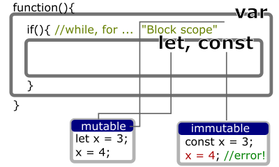
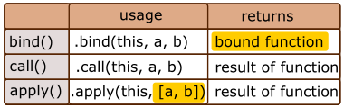
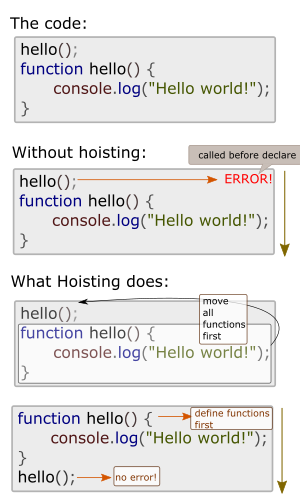
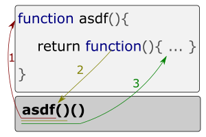

[JavaScript]
# Javascript terms for (not only) juniors (but also mid-levels)
From [this tweet](https://twitter.com/cat__logic/status/1285921212170940416?s=20).

## let vs var vs const (+ variable scopes)

* Level: Basic

* Related MDN docs: [let](https://developer.mozilla.org/en-US/docs/Web/JavaScript/Reference/Statements/let), [var](https://developer.mozilla.org/en-US/docs/Web/JavaScript/Reference/Statements/var), [const](https://developer.mozilla.org/en-US/docs/Web/JavaScript/Reference/Statements/const)



## bind vs call vs apply

* Level: Hard

* Related MDN docs: [bind](https://developer.mozilla.org/en-US/docs/Web/JavaScript/Reference/Global_Objects/Function/bind), [call](https://developer.mozilla.org/en-US/docs/Web/JavaScript/Reference/Global_Objects/Function/call), [apply](https://developer.mozilla.org/en-US/docs/Web/JavaScript/Reference/Global_Objects/Function/apply)

If you don't know what they are: they can define what is `this` for the functions.

The usage of bind, call, apply looks almost same - bind and call are same, and apply uses array instead of parameters. It means that call(this, ...[a, b]) and bind(this, [a, b]) results same.



> Note: As you see, **`bind()` creates new method** because `bind()` returns new function! `myFunction.bind()` is not `myFunction` anymore! This affects e.g. when removing specific event from `EventListener`.

## Hoisting

* Level: Medium

* Related MDN docs: [Hoisting](https://developer.mozilla.org/en-US/docs/Glossary/Hoisting)

If you have tried C or C++, you know they don't have this one. Or you may forgot it, when JavaScript is too familiar to you.



This process is not visible to your code, but internally happens.

## Closure

* Level: Hard
* Related MDN docs: [Closures](https://developer.mozilla.org/en-US/docs/Web/JavaScript/Closures)

If you learned C# and saw what is `delegate`, it's easier to understand what closure is. It points another function (and works also similar to 'method group' in C#)



One of the difference from C# `delegate` is invoking - JavaScript provides more flexible and easy syntax to invoke them. The example in the MDN page is interesting:

```javascript
function makeLabel(label){
    return function(value){ return label + ": "+ value; }
}
var nameLabelMaker = makeLabel("Name");
var nameLabelOne = nameLabelMaker("John"); //Name: John
var nameLabelTwo = nameLabelMaker("Daisy"); //Name: Daisy
```

It can define what kind should be produced first (Name), and use the produced function (John, Daisy).

## == vs ===

* Level: Basic

* Related MDN docs: [Equality comparisons and sameness](https://developer.mozilla.org/en-US/docs/Web/JavaScript/Equality_comparisons_and_sameness)

== is loose equality, and === means strict equality.

Well-known example is number and string comparison, `42 == "42"` but `42 !== "42"`. But when it extends to others, such as empty array or object, it becomes more complicated.

About the detail, which ones are same with loose equality, see more on [the MDN docs](https://developer.mozilla.org/en-US/docs/Web/JavaScript/Equality_comparisons_and_sameness) - it's more complicated.

But you don't need to remember everything, which ones are same with loose equality, because **strict equality (===) is used** in practice to avoid confusion (and should be).

## Falsy / Truthy variables

* Level: Basic

* Related MDN docs: [Falsy](https://developer.mozilla.org/en-US/docs/Glossary/Falsy), [Truthy](https://developer.mozilla.org/en-US/docs/Glossary/Truthy)

Some syntaxes requires `boolean` value, such as `if()` or `while()`. Well-known case of truthy and falsy values are "0 is false" and "1 is true" (like C or C++).

But JavaScript is so non-strict, so any other things than real `true`, `false`, 0 or 1 can go into `if()` to check if it's true.

The falsy values are: `null`, `undefined`, `0`, `""` (empty string), `NaN` - others are truthy.

> Note: "0" (string), empty arrays and empty objects are truthy, but empty array and `"0" == false` and `[] == false`. **Truthy value does not always mean that the value is non-strictly equal to true**.

## IIFE (Immediately Invoked Function Expression)

* Level: Basic
* Related MDN docs: [IIFE](https://developer.mozilla.org/en-US/docs/Glossary/IIFE)

It's easy to understand, but may not very important for beginners.

It looks like this.

```javascript
(function(){
})();
```

With IIFE, you can add parameter to it like this.

```javascript
(function(x){
    console.log(x);
})("hello, world!");
```

As the name says, this IIFE function fires **immediately** without need to assign the function.

IIFE wraps all the variables inside. Since IIFE directly contains anonymous function that executes immediatly, there are no concern of name duplication. It also wraps scopes inside and prevents functions and variables from being global.

## functions vs => (Arrow function expression)

* Level: Medium

* Related MDN docs: [Arrow function expressions](https://developer.mozilla.org/en-US/docs/Web/JavaScript/Reference/Functions/Arrow_functions)

It changes this function

```javascript
function( ... ) { ... }
```

into

```javascript
( ... ) =>  ...
```

Is it syntax sugar? If they're identical, they are, but there are one significant difference - it's `this`. This will be explained later.

## Anonymous functions

Level: Basic

Something that looks like this are anonymous functions:

```javascript
function(){
    //something
}
```

Which means literally "anonymous", without name.

The anonymous functions can be assigned as variable, or can be placed in the place of callback.

```javascript
var x = function(){
    // something
}
setTimeout(function(){
    //something
}, 1000);
```

> Note: Don't expect hoisting with anonymous functions that registered to variable.
>
>```javascript
> x(); //Error! Because x is variable that contains anonymous function.
> var x = function(){ console.log("Hello world!"); }
>```

## forEach() vs map()

Level: Basic-Medium

Both applies each values to the callback function. Simply, the difference is return value.

`forEach()` just "does the work", while `map()` actually "returns" the results.

## null vs undefined

Level: Hard

```javascript
typeof(null) //object
typeof(undefined) //undefined
```

`null` is **empty object**, whereas `undefined` is **not definied**.

Undefined is **a type** for any unassigned value. When something is unassigned but used, using default value or throwing error is expected. JavaScript uses dynamic type, even if the type exists (`typeof` shows the type). So JavaScript cannot set the value depending on the type. So that's why `undefined` is default when value is not defined or unassigned.

Still `undefined` is weird thing on JavaScript - when value is not defined or unassigned, throwing error is better solution for preventing weird errors.

## this

* Level: Hard

* Related MDN docs: [this](https://developer.mozilla.org/en-US/docs/Web/JavaScript/Reference/Operators/this)

It's one of the greatest question. `this` on JavaScript is not only hard but also confusing.

before starting, you must understand: globalThis and what the `'use strict'` does.

Without strict mode, it returns `globalThis` if `this` is not defined. In strict mode, `globalThis` is returned, only the `this` is accessed directly, outside any function, class, object.

* Non-strict mode: Is there definition about `this`? -> No ->  `globalThis`

* Strict mode: Is there definition about `this`? -> No -> `undefined`

* `this` is "defined": inside object / class, defined manually (bind / call / apply), global value (globalThis)

* `this` is "not defined": inside function (includes IIFE)

Since this one is complicated (and will need separated article), I recommend to read more from [MDN](https://developer.mozilla.org/en-US/docs/Web/JavaScript/Reference/Operators/this) if you want to know about more.

### With  Arrow Functions

**Arrow function doesn't care about the custom `this` context**, which means, *`thisObj`* affects nothing to arrow functions via `bind`, `call` and `apply`.

```javascript
var arrow = ()=>this;
var nonArrow = function(){ return this; };
arrow.call("any this"); //returns globalThis
nonArrow.call("any this"); //returns string "any this"
```

Same thing can be found when event listener is used - **with arrow function, the value of `this` is consistent**. When the event callback is arrow function, `this` isn't HTML element but the default value. If you want to use class variables with DOM event, arrow function simply can solve the problem.

The arrow function's `this` means current "instance". So it doesn't consider the parent object as `this`.

```javascript
var asdf = {
    x:function(){ return this },
    y:()=>this
};
asdf.x() //returns object asdf
adsf.y() //returns global this
```

```javascript
function x(){
  var a = function(){ console.log(this) }
  var b = () => console.log(this)
  a(); //Window
  b(); //x
}
new x(); //Note: calling x() without new keyword results same value.
```